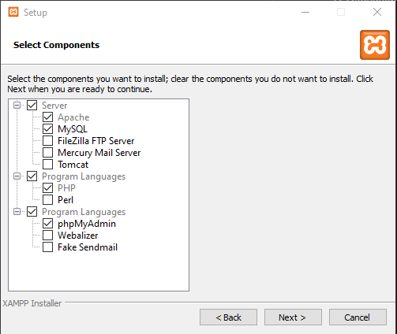

# ПРАКТИЧЕСКАЯ РАБОТА № 1

> Во всех скриптах в заголовке окна браузера должны быть ваши фамилия и имя!

## Подготовка рабочей области

Для работы с PHP мы будем использовать набор XAMPP (Apache + MariaDB + PHP + Perl)  
Если вы используете что то другое, этот пункт можно пропустить.

1. Скачиваем XAMPP по [ссылке](https://www.apachefriends.org/ru/index.html)
2. Устанавливаете приложение.
   1. Выбираем соответствующие пункты  

   1. Выбираем папку, в которой будет размещаться приложение  

   1. Выбираем язык программы
   2. Убираем галочку **Learn more**
   3. Нажимаем далее и ждём завершение установки.
1. Запускаем **XAMPP Control Panel**  

4. Нажимаем кнопку **start** напротив **Apache**  

5. Открываем браузер (я буду использовать [Firefox](https://www.mozilla.org/ru/firefox/)) и вводим адрес [http://localhost](http://localhost)
6. Открываем **C:\xampp\htdocs** и удаляем все файлы. Тут "корень" нашего сервера. 

Всё, сервер готов!

## УПРАЖНЕНИЕ 1-0. Подготовительная работа

1. В корневой папке только что созданного сервера создайте новый текстовый файл с именем code_1.php. 
2. Откройте этот файл с помощью редактора и впишите в него следующий код:  
 
3. В браузере на странице [http://localhost/code_1.php](http://localhost/code_1.php) будет подобный вывод:  
 
4. Наш сервер работает!

## УПРАЖНЕНИЕ 1-1.

1. Создайте новый текстовый файл с именем lab-1-1.php с кодом:  

2. В браузере на странице [http://localhost/lab-1-1.php](http://localhost/lab-1-1.php) будет подобный вывод:  

## УПРАЖНЕНИЕ 1-2.

1. Создайте новый текстовый файл с именем lab-1-2.php с кодом:  

2. В браузере на странице [http://localhost/lab-1-2.php](http://localhost/lab-1-2.php) будет подобный вывод:  

## УПРАЖНЕНИЕ 1-3.

1. Создайте php-скрипт lab-1-3.php, в котором создайте константу NUM_E со значением 2.71828 (число е). 
2. Выведите на экран значение этой константы в виде строки "Число e равно …". 
3. Присвойте переменной $num_e1 значение константы и выведите на экран имя переменной $num_e1, ее значение и тип (т.е. в браузере должна получиться строка вида «$num_e1 = 2.71828  ‑ double»). 
4. Последовательно измените тип переменной $num_e1 на строковый, целый и булевский, каждый раз отображая тип и получившееся значение переменной $num_e1. 
5. В браузере на странице [http://localhost/lab-1-3.php](http://localhost/lab-1-3.php) должен быть подобный вывод:  

# САМОСТОЯТЕЛЬНАЯ РАБОТА № 1

Создайте php-скрипт lab-1-5.php, в котором вычисляется значение заданного выражения для случайных аргументов из интервала [-20, 20], а затем выводится на экран сама формула (с заменой имен переменных на их значения) и результат вычислений.  
Протестируйте работу скрипта и объясните полученный результат.

| №   | f(a, d, c)                                         | №   | f(a, d, c)                                       | №   | f(a, d, c)                                   |
| --- | -------------------------------------------------- | --- | ------------------------------------------------ | --- | -------------------------------------------- |
| 1   | $$ \frac{2 * c - d}{\frac{a}{4} - 1} $$            | 6   | $$ \frac{2*c-42*d}{c+a-1} $$                     | 11  | $$ \frac{(c-\frac{d}{2} )*(b-7)}{2*a-1} $$   |
| 2   | $$ \frac{2 * c - \frac{d}{23}}{1 - \frac{a}{3}} $$ | 7   | $$ \frac{42 * c - \frac{d}{2}+1}{a^{2}-b-5} $$   | 12  | $$ \frac{4*c-\frac{d}{2}}{a^2-1} $$          |
| 3   | $$ \frac{2 * c + 51 * d}{d - a - 1} $$             | 8   | $$ \frac{b*(2*c)+d-52}{\frac{a}{3}+1} $$         | 13  | $$ \frac{c * (b+23)}{\frac{a}{2}-4*d-1} $$   |
| 4   | $$ \frac{c+4*d-12}{1 - \frac{a}{2}} $$             | 9   | $$ \frac{\frac{25}{c} - d + 2}{d + a^{2} - 1} $$ | 14  | $$ \frac{\frac{c}{d}+3\frac{a}{2}}{c-a+1} $$ |
| 5   | $$ \frac{4*c+d-1}{c-\frac{a}{2}} $$                | 10  | $$ \frac{\frac{2*c}{d} + 2}{d - a^{2} - 1} $$    | 15  | $$ \frac{\frac{12}{c}+73-d^2}{a^2-2*a} $$    |